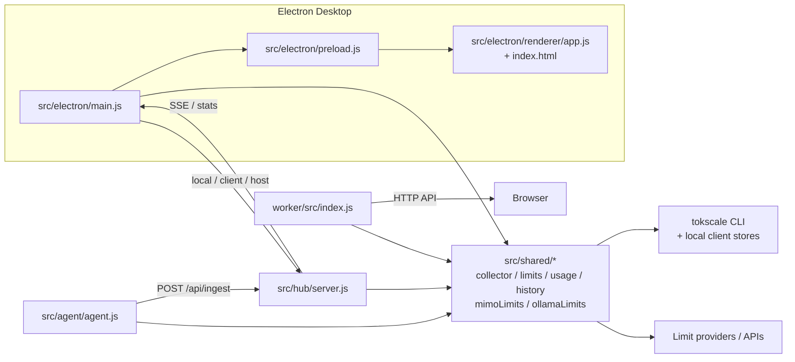

# 架构说明

> 基线：upstream v0.25.0（`6ce2b8f`），2026-07-12 更新。

## 总体结构

Token Monitor 的核心分层可以概括为：Electron 负责桌面壳和交互，`src/shared/` 负责采集与归一化逻辑，hub 负责聚合，agent 负责无界面采集，worker 负责云端部署。

## 各入口职责

### `src/electron/main.js`

这是主进程，职责是：

- 创建和管理窗口。
- 读写 `settings.json`。
- 根据 `hubMode` 在 local / client / host 间切换。
- 启动 local collector、sync collector 或 embedded hub。
- 对 renderer 提供 IPC。
- 做敏感配置的 redaction。
- 管理 MiMo / Ollama 等 web cookie 型 provider 的凭据读写（v0.25.0 新增）。

它是整个桌面产品的调度中心，但不直接实现采集算法。

### `src/electron/preload.js`

preload 暴露安全的 IPC 接口给 renderer。renderer 不直接访问 Node API，而是通过这里调用主进程。

### `src/electron/renderer/*`

renderer 负责所有界面渲染和交互状态：

- `index.html` 定义 DOM 结构。
- `app.js` 负责视图状态、数据绑定和交互。
- `dashboard.js` / `dashboard.html` 负责趋势和概览窗口。
- `homeOverview.js`、`usageCharts.js` 是局部渲染辅助。

### `src/shared/*`

这是采集和数据模型的单一事实来源：

- `collector.js` 负责本地 usage 收集。
- `limitCollector.js` 负责 limits 收集（编排所有 provider）。
- `limits.js` 负责 limits 归一化、公开版脱敏和同步版保留。
- `mimoLimits.js` 负责 MiMo Cloud 多账号 cookie 验证与 quota 查询（v0.25.0 新增）。
- `ollamaLimits.js` 负责 Ollama Cloud session cookie 验证与使用量查询（v0.25.0 新增）。
- `usage.js` 负责设备记录、聚合、历史和归一化。
- `history.js` 负责历史汇总逻辑。

### `src/hub/server.js`

这是本地 Node hub。它接收 device record，做聚合，再向 widget 提供 stats / history / stream。v0.25.0 增加了 payload 大小限制（413 响应）。

### `src/agent/agent.js`

这是无界面采集入口，面向后台任务、常驻守护或没有 Electron 的机器。

### `worker/src/index.js`

这是可部署到 Cloudflare Worker 的 hub 形态。它需要保持与本地 hub 相同的数据模型和协议约定。

## 关键约束

1. `src/shared/` 是协议与数据模型的源头。
2. `worker/src/shared/` 是生成副本，不能手改。
3. collector 负责"如何采"，hub 负责"如何聚合"，renderer 负责"如何展示"，不要把这三层揉在一起。
4. 对外协议稳定性优先于 UI 重构。

## 运行模式

### Local

widget 自己采集、自己展示，不依赖 hub。

### Client

widget 既订阅远端 hub 的 SSE，也把本机数据推上去。

### Host

widget 本机带 hub，同时本机也做采集。

### Agent

agent 只做采集和上报，不负责 UI。

### Worker

worker 只负责云端 API，不做桌面交互。
